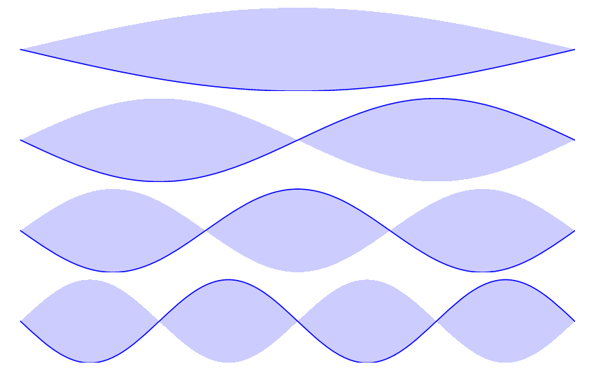
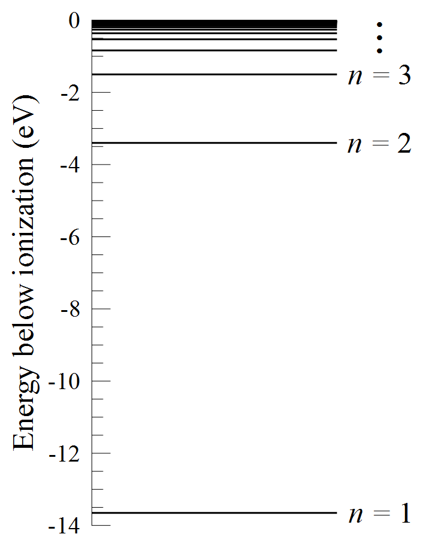
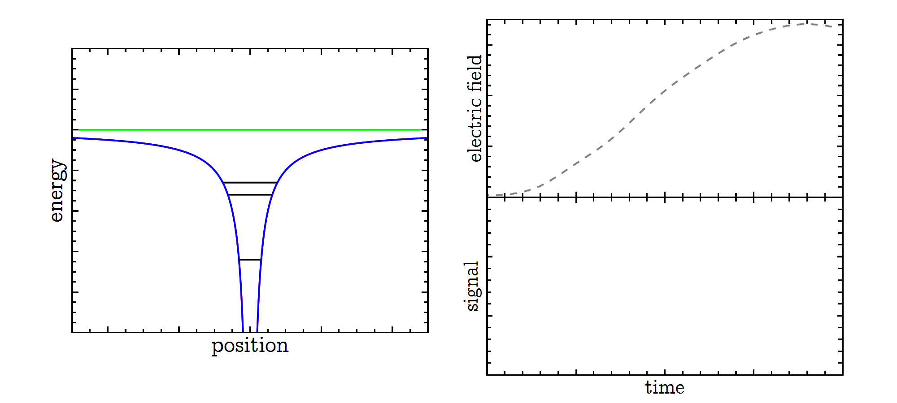

Quantum mechanics tells us that on small scales (like atoms and molecules), matter behaves like waves. When a wave is confined in space (like a jump rope, or an electron in an atom), it can only have certain, discrete amounts of energy. You can think of this like rungs on a ladder: the electron must be on one of the energy “rungs”, not somewhere in between. 

The image below shows some of the possible states for a wave on a jump rope, with each state corresponding to a different energy.

The graph below shows the allowed energies for an electron in an atom. We label the possible energy states with different integers, *n*, which can be any whole number from 1 to infinity.

I study atoms on high rungs of the energy ladder (“Rydberg” atoms), with *n* ≈ 30 and above. In each experiment, I use one of several techniques to manipulate the atoms, and then I measure their final energy state. 

To see what energy state the atoms are in, I use a detection method called "selective field ionization." When you apply an electric field to an electron, it starts to move in the opposite direction as the electric field. But in an atom, the negatively-charged electron is attracted to the positively-charged nucleus. If you apply an electric field that is strong enough, the electron can break away from the pull of the nucleus (this is called "ionizing" the atom), and we can detect it. The higher the initial energy of the electron, the easier it is for an electric field to rip the electron from the atom. 

This process is shown schematically in the figure below. On the left side, the red curve represents the pull of the nucleus, creating a "well" for the electrons to sit in. The green line is from the applied electric field, which effectively tips the well to one side, allowing the electron to escape. The blue curve is the combination of the effects of the nucleus and the electric field. The horizontal black lines represent different energy states of the electron. Electrons in the highest energy state are ionized at lower electric fields, when the well is not tipped over as much. Lower energy states need higher electric fields in order to be ionized. To tell which states the atoms were in, we slowly increase the strength of the electric field (shown by the green graph on the top right). We see peaks in our detector corresponding to electrons in different energy states (bottom right graph). The peak on the left of this graph comes from a higher energy state (ionized at a lower electric field), while the peak on the right comes from a lower energy state (ionized at a higher electric field).

This is how selective field ionization is used to determine the energy state of an electron. Unfortunately, the real world is a bit messier than this description. When you apply an electric field to an atom, the allowed energies shift and split (shown in Figure 2 of the poster). This causes the signals from electrons in different states to bleed together—even if the electrons have different energies, if the energies are too close together, they will be indistinguishable in our detector. The result would be something like the two signals shown in Figure 2(e) on the poster.

