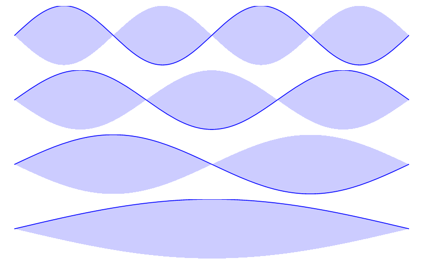

# Genetic Algorithm Project Description

The work described in this poster is a project to use a genetic algorithm to separate previously overlapped field ionization signals from two different atomic energy states. That's a lot of jargon, so let's break this down and look at each component of the project in more detail. First, we'll take a look at what atomic energy states are. Then we'll discuss how we can detect an atom's state using a technique called field ionization. Finally, we'll see what a genetic algorithm is and how it can help us control and improve the field ionization technique.

### Atomic Energy States
Quantum mechanics tells us that on small scales (like atoms and molecules), matter behaves like waves. When a wave is confined in space (like a jump rope, or an electron in an atom), it can only have certain, discrete amounts of energy. You can think of this like rungs on a ladder: the electron must be on one of the energy “rungs”, not somewhere in between. 

The image below shows some of the possible states for a wave on a jump rope, with each state corresponding to a different energy (increasing in energy from bottom to top). 

The wave patterns for an electron in an atom are a little more complicated to visualize, but we can take a look at the allowed energies, shown in the graph below for a hydrogen atom. We label the possible energy states with different integers, *n*, which can be any whole number from 1 to infinity. The energy states start to bunch up as *n* increases, but they are still discrete (only certain energy values are allowed, nothing in between).

 

### Field Ionization
I study atoms on high rungs of the energy ladder (“Rydberg” atoms), with *n* ≈ 30 and above. In each experiment, I use one of several techniques to manipulate the atoms, and then I measure their final energy state. 

To see what energy state the atoms are in, I use a detection method called *field ionization*. When you apply an electric field to an electron, it starts to move in the opposite direction as the electric field due to the electron's negative charge. But in an atom, the negatively-charged electron is attracted to the positively-charged nucleus, which tries to keep the electron in place. If you apply an electric field that is strong enough, the electron can break away from the pull of the nucleus (this is called *ionizing* the atom), and we can detect it. This process depends on the energy state of the electron. It is easier for an electric field to ionize electrons in higher energy states, since these electrons are already closer to breaking free of the nucleus compared to lower energy electrons. 

The process of field ionization is shown schematically in the figure below. On the left side, the red curve represents the pull of the nucleus, creating a "well" for the electrons to sit in. The green line is the energy associated with the applied electric field, which becomes steeper as the electric field increases over the course of the animation. The blue curve is the combination of the effects of the nucleus and the electric field. As the electric field is increased, it effectively tips the well to one side, allowing the electron to escape. The horizontal black lines represent different possible energy states of the electron. Electrons in the highest energy state are ionized at lower electric fields, when the well is not tipped over as much. Lower energy states need higher electric fields in order to be ionized. 

To tell which states the atoms were in, we slowly increase the strength of the electric field over time (shown by the green graph on the top right). We see peaks in our detector corresponding to electrons in different energy states (bottom right graph). The peak on the left of this graph comes from a higher energy state (ionized at a lower electric field), while the peak on the right comes from a lower energy state (ionized at a higher electric field). The size of these peaks corresponds to how many atoms were in a given energy state.

This is how selective field ionization is used to determine the energy state of an electron. Unfortunately, the real world is a bit messier than the description above. When you apply an electric field to an atom, the allowed energies shift and split (shown in Figure 2 of the poster), a phenomenon known as the Stark effect. This causes the signals from electrons in different states to bleed together -- even if the electrons have different energies, if the energies are too close together, they will be indistinguishable in our detector. The result would be something like the two signals shown in Figure 2(e) on the poster (repeated below). Even though the solid, red line and the dashed, blue line come from different states, their detector signals are significantly overlapped. This means that if we have a mix of both states in our system, we won't be able to tell how many atoms are in each state. 

### Genetic Algorithms
In order to be able to distinguish between two overlapping states, I used a genetic algorithm to control the field ionization process. This is the main result presented in the poster. Before we dive into how the genetic algorithm is able to control field ionization, let's look at what it is and how it works.

A genetic algorithm is an artificial intelligence technique that works in analogy to Darwin's theory of evolution. It uses the concepts of competition/"survival of the fittest", procreation, genes, and mutation to "evolve" a solution over many generations. Genetic algorithms are good at solving problems that have a very large number of potential solutions, as long as the general form of the solution is well-defined and there is a clear criteria to measure how "good" a solution is. 

For example, let's say you want to generate directions for driving from point A to point B. There are many different ways to get from A to B. Each solution would be a set of instructions to go left, right, or straight at each intersection. The criteria for selecting the "best" solution might be to minimize the travel time. Note that a genetic algorithm is not necessarily the best way to solve this problem in real life, but it's a good example to help us understand how the algorithm works. Let's explore the details of a genetic algorithm using this example of driving from A to B. 

The first step of a genetic algorithm is to create an initial population of many potential solutions (the first generation for our "species"). Each individual of the population is described by a set of "genes." In our example, the genes for one member of the population would be a set of turning instructions. Next, we would calculate a *fitness score* which measures how well each individual in the population achieves the target goal. In the driving example, the fitness score might be 1 divided by the travel time (short travel times correspond to high fitness). To produce a second generation of (better) solutions, we will use the concept of survival of the fittest. The solutions from the first generation with the highest fitness scores will be selected as parents. We create offspring by combining genes from two of the parents. For example, we could take the first half of the  turning instructions from one parent and the second half from another parent. After creating a group of "children" making up the second generation of solutions, we can "mutate" some of the genes by randomly changing a few of the turning instructions. This introduces genetic variety, allowing the algorithm to find new solutions which could be better than any combinations of the previous generation. Once we have a second generation of solutions, we evaluate the fitness scores, and repeat the process over again. This continues for many generations, until the best solution in the final generation is close enough to our target goal. The process described above is shown visually in Figure 5 from the poster (repeated below). 

### Using a Genetic Algorithm to Control Field Ionization
So how can we use a genetic algorithm to improve our ability to distinguish atomic states with field ionization? It turns out that the shape of the ionization signal (e.g., Figure 2(e)) is very sensitive to how quickly the electric field is increased for each instant during the ionization process. If we add a small "wiggle" on top of the steadily increasing electric field, we can control the shape of the ionization signal. This is shown schematically in Figure 4 from the poster. The green curve is the steadily increasing electric field, and the red graph is the small "wiggle" (called a *perturbation*) in the electric field. Note that the scales on the graphs are different, so the perturbation is much smaller than the increasing electric field. When these two fields are added together, we get the blue graph on the right. The inset in this graph shows that the field has small variations up and down as it increases. 

The genetic algorithm is used to determine the perturbation needed to get the desired ionization signal shape. Since there are a large number of "wiggles" in each possible perturbation, calculating the best perturbation using conventional methods would be impossible. Instead, we start with an initial population of random perturbations, calculate the fitness scores (how well they achieve the target signal shape), and evolve the perturbations over many generations. 

We used this technique to separate the overlapping ionization signals from two different atomic states. Our results are shown in Figure 6. Each column of this figure is a different experiment, using a different way of calculating fitness scores. The first row of graphs (a - c) shows the overlapping signals from the two states prior to running the genetic algorithm. In these graphs, the red and blue signals are both spread out over the range from 40 ns to 120 ns. The middle row (d - f) shows the best separation we achieved during the last generation of the genetic algorithm. Notice how the red signal is generally pushed to the left and the blue signal is pushed right. There are still some places where the signals are overlapped, but the large peaks in the red correspond to a small blue signal, and vice versa. The graphs in the bottom row (g - i) show how the overlap between the two states decreases over the generations. For our best result, we were able to decrease the overlap between these two states from 77% initially to 15% after running the genetic algorithm. This is a large improvement, but we would ideally like to get this down to 0% overlap. There are several ways we might adjust the genetic algorithm or the experimental setup to try to improve the performance. For example, we could change the number of population members, the mutation rate, or how the fitness score is calculated. 